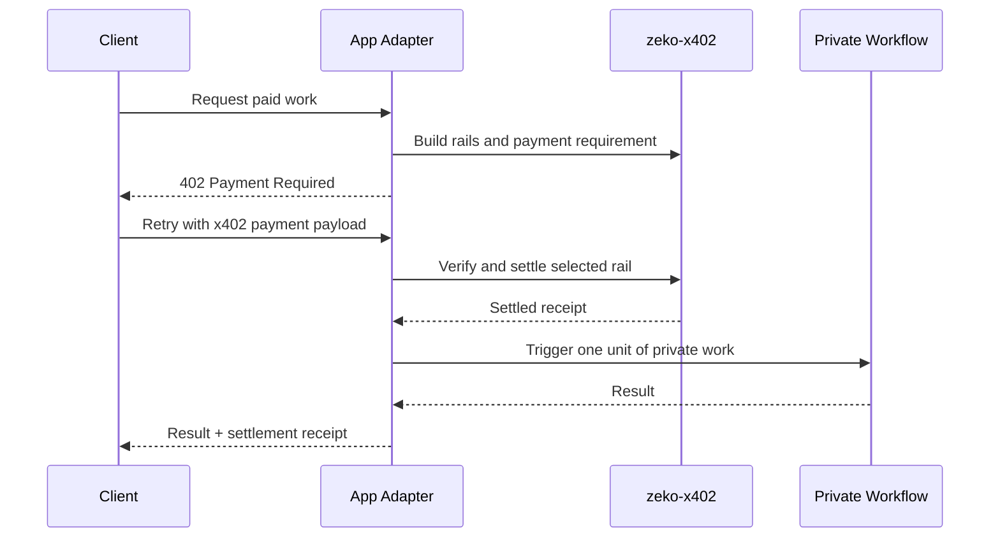

# Adapter Architecture

This doc is the handoff for a separate app or agent adapter repo that wants to monetize private work through `zeko-x402`.

The first use case in mind is a private agent running on Zeko infrastructure while charging on Ethereum or Base mainnet, but the adapter described here should stay app-specific and live outside this repo.

## Recommended v1

Ship the first adapter around one simple promise:

- the app runs privately on Zeko
- the payment settles on Ethereum or Base
- the app developer brings `payTo` and relayer credentials
- `zeko-x402` handles x402 payment negotiation and settlement rails

That means the initial adapter can focus on Ethereum and Base while still requiring Zeko as the work layer. The initial unlock is letting a Zeko-hosted workflow get paid through the EVM rails people already expect.

## Boundary

Keep the split strict.

### Build in `zeko-x402`

Use this repo for:

- x402 headers, payloads, and protocol helpers
- Ethereum and Base rail builders
- Zeko rail builders
- facilitator clients and self-hosted EVM relayer behavior
- escrow inspection helpers for hosted dedicated-escrow registration
- payment verification and settlement receipts
- tenant-safe concepts such as `payTo`, relayer separation, quotas, and usage accounting

### Build in the separate adapter repo

Build the app-specific layer there:

- app or agent registration
- route handlers for private work
- pricing policy per task, route, or capability
- mapping a settled x402 payment to a single unit of app work
- result formatting, receipts, and app-specific verification URLs
- optional SDK wrappers like `withX402(...)`

Rule of thumb:

- if another app could reuse it, keep it in `zeko-x402`
- if it depends on your app's workflow or output format, keep it in the adapter repo

## Safest hosted model

The hosted service should not sponsor arbitrary third-party gas.

For each developer or tenant:

- register `payTo`
- register one relayer per EVM network
- require the developer to fund that relayer wallet
- only relay to registered `payTo`
- only relay through the registered relayer

That gives you:

- no shared gas pool to drain
- clean per-tenant accounting
- a simple abuse boundary
- a managed experience without managing the developer's payout funds

If you do not want to hold relayer keys, the same adapter shape can support a bring-your-own signer endpoint later. For v1, an encrypted managed relayer is the easiest path.

## Adapter flow

The separate adapter repo should implement this flow.

1. Receive a request for private work.
2. Resolve the developer or tenant account.
3. Resolve the configured EVM rails for that tenant:
   - Ethereum and Base
4. Build one standard `402 Payment Required` response with multiple `accepts` options.
5. Let the client choose a rail and submit an x402 payment payload.
6. Verify and settle that payload through `zeko-x402`.
7. Only after successful settlement, trigger the private workflow.
8. Return the work result plus the x402 settlement receipt and any app-specific verification URL.

The important sequencing rule is:

- payment settlement unlocks the work
- the adapter repo decides what work to run
- `zeko-x402` should not know what that work is

## Minimal adapter responsibilities

The separate repo needs four pieces.

### 1. Tenant config

Store:

- `tenantId`
- `apiKey`
- `defaultNetwork`
- `ethereum.payTo`
- `ethereum.relayer`
- `base.payTo`
- `base.relayer`
- allowed rails
- price policy

The adapter should treat `payTo` and relayer as different roles:

- `payTo` receives payment
- relayer submits the EVM transaction and pays gas

### 2. Paid work endpoint

Expose one route that can do both:

- return `402 Payment Required` when unpaid
- run the private task after payment is settled

This route is the real product surface for app developers and agents.

### 3. Verification and settlement bridge

The adapter should call into `zeko-x402` for:

- `buildCatalog(...)`
- `buildPaymentRequired(...)`
- `verifyPayment(...)`
- EVM facilitator client or self-hosted facilitator calls
- `buildSettlementResponse(...)`

The adapter should not re-implement x402 settlement rules itself.

### 4. Work receipt mapping

After settlement succeeds, the adapter should bind the payment to one app-specific work unit, such as:

- one task run
- one result fetch
- one capability invocation
- one time-boxed session

That mapping belongs in the adapter repo because it is app policy, not payment protocol.

## Minimal request lifecycle



## Recommended v1 defaults

For the first adapter release:

- Ethereum mainnet USDC and Base mainnet USDC should both be first-class advertised rails
- Zeko-backed execution remains required
- Zeko-native settlement can be introduced behind a feature flag when the product wants that additional rail

That keeps the first shipping experience familiar:

- clients still see normal x402 on EVM
- the private work can still run on Zeko
- the Zeko-specific rail can be added later as the differentiated upgrade path

## Example shape

The adapter repo can stay thin. Conceptually:

```ts
import {
  buildBaseMainnetUsdcRail,
  buildEthereumMainnetUsdcRail,
  buildCatalog,
  buildPaymentRequired,
  buildSettlementResponse,
  verifyPayment
} from "zeko-x402";

export async function handlePaidWork(request, tenant) {
  const rails = [
    ...(tenant.ethereum?.enabled
      ? [
          buildEthereumMainnetUsdcRail({
            amount: tenant.pricing.ethereumAmount,
            payTo: tenant.ethereum.payTo,
            facilitatorUrl: tenant.ethereum.facilitatorUrl
          })
        ]
      : []),
    ...(tenant.base?.enabled
      ? [
          buildBaseMainnetUsdcRail({
            amount: tenant.pricing.baseAmount,
            payTo: tenant.base.payTo
          })
        ]
      : [])
  ];

  const context = {
    serviceId: tenant.serviceId,
    baseUrl: tenant.baseUrl,
    sessionId: request.sessionId,
    turnId: request.turnId,
    rails
  };

  return {
    catalog: buildCatalog(context),
    required: buildPaymentRequired(context)
  };
}
```

The actual private workflow trigger should stay outside this helper.

## Abuse rules for the hosted service

If you host a managed adapter or managed facilitator, enforce these rules:

- API key required
- only pre-registered `payTo` addresses
- only pre-registered relayer wallets
- only allowed networks per tenant
- minimum charge floor per network
- rate limits
- daily caps
- no open relay for arbitrary `payTo`

That is the minimum shape that keeps the hosted service from turning into a free gas relay for strangers.

## What to build next in the adapter repo

The separate repo should implement:

1. tenant onboarding
2. `payTo` and relayer verification
3. one paid work endpoint
4. one dev-facing wrapper like `withX402(...)`
5. one quickstart that shows Ethereum- and Base-backed monetization for a private Zeko-hosted workflow

That is enough for the first real developer release.

See `docs/tenant-onboarding.md` for the hosted registration and operating-model spec that the separate adapter repo should implement.
