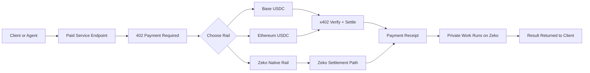

# x402 on Zeko: A One-Page Overview

`zeko-x402` is a multi-rail x402 toolkit for services that run on Zeko but want to get paid through the payment rails developers already use today.

The simple idea is:

- the work can run privately on Zeko
- the payment can settle on Base mainnet
- Ethereum mainnet can be offered too
- Zeko-native settlement can sit alongside those rails when a service wants stronger verification or privacy

This keeps the front door familiar while letting Zeko become the place where new behavior shows up.

## Why this matters

Today, many developers want to run private workflows, agent tasks, or proof-backed services without forcing their users to learn a new payment path first.

The fastest path to adoption is:

- keep the payment negotiation as standard x402
- offer Base first, because that matches the default x402 mental model
- optionally offer Ethereum mainnet too
- let the service itself run on Zeko

That means a developer can deploy private logic on Zeko infrastructure and still charge through the EVM rails users already expect.

## What stays standard

`zeko-x402` does not need a new payment protocol to do this.

The standard pieces stay the same:

- `402 Payment Required`
- `PAYMENT-REQUIRED`
- `PAYMENT-SIGNATURE`
- `PAYMENT-RESPONSE`
- one resource with multiple `accepts` options

In practice, the same paid endpoint can advertise:

1. Base mainnet USDC
2. Ethereum mainnet USDC
3. a Zeko-native rail

That makes compatibility the default, not an afterthought.

## Where Zeko adds value

Base and Ethereum are the compatibility rails.
Zeko is the upgrade rail.

That upgrade can eventually include:

- verified-result receipts
- privacy-forward payment gating
- proof-backed settlement logic
- tighter binding between “payment accepted” and “work was actually performed”

So the point is not to replace standard x402. The point is to keep x402 recognizable while giving Zeko a place to improve what happens behind the payment.

## Hosted and self-hosted

`zeko-x402` is designed to work in both modes.

### Self-hosted

A developer can run the facilitator and settlement path themselves.

### Managed

A platform can host the x402 control plane for many developers, as long as each developer brings:

- their own `payTo` wallet
- their own relayer wallet
- their own network-specific gas funding

That model is important because it avoids turning the hosted service into a shared gas pool that can be abused.

## The core flow

## The architecture in one sentence

Use standard x402 to unlock access, use Base or Ethereum for the default payment path, and use Zeko as the execution and verification layer behind the service.

## What ships first

The most practical first release is:

- Base mainnet USDC as the default rail
- Ethereum mainnet USDC as an optional rail
- Zeko-native settlement as an optional advanced rail
- a self-hostable toolkit for developers
- a hosted control plane for teams that want turnkey adoption

That gives developers an immediate path to monetize private Zeko-hosted workflows without asking users to abandon the x402 ecosystem they already know.

## Shareable summary

`zeko-x402` lets developers run private services on Zeko while accepting standard x402 payments on Base or Ethereum. The payment flow stays familiar, the service logic can stay private, and Zeko becomes the place where verified-result and privacy-preserving upgrades can emerge over time.
